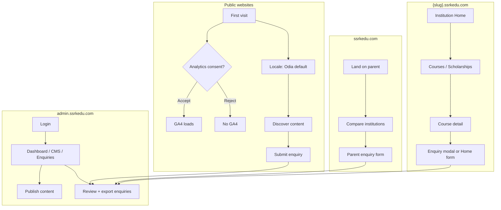
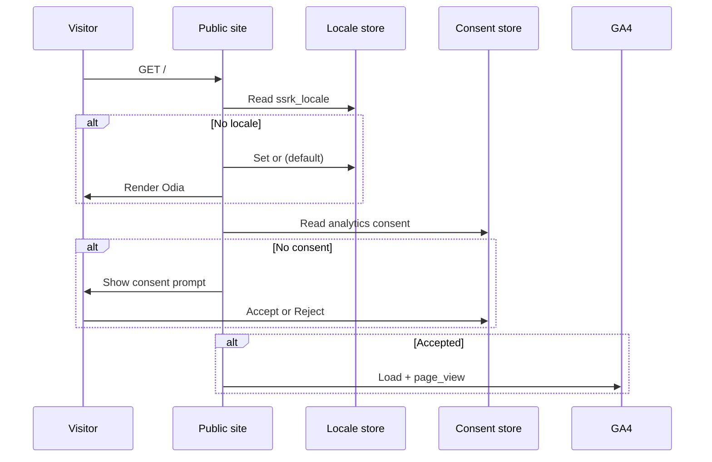
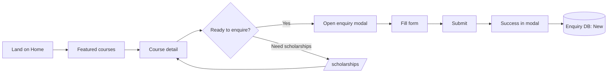
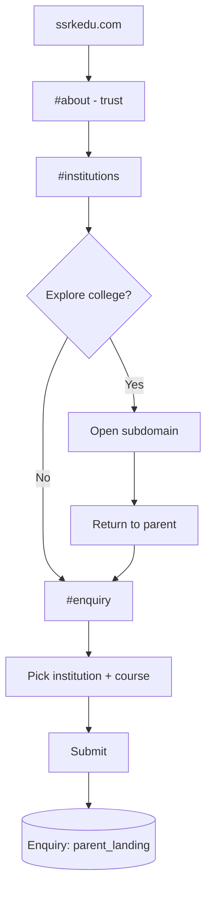
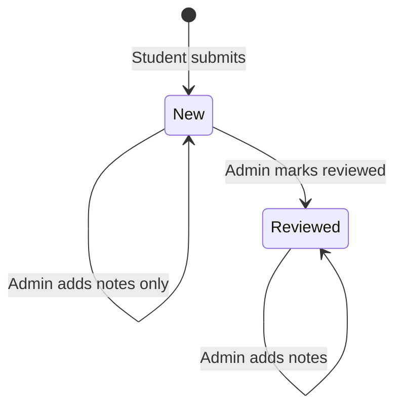
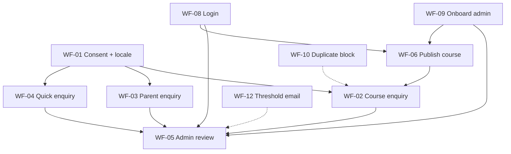

# SSRK Edu Platform — User Workflows (MVP)

| Field | Value |
|-------|-------|
| **Document ID** | SSRK-UWF-001 |
| **Version** | 1.0 |
| **Status** | Draft — pending stakeholder review |
| **Date** | 2026-06-27 |
| **Derived from** | [BRD v1.0](./ssrkedu-brd-v1.md) · [MVP Scope v1.8](./ssrkedu-mvpScope-v1.md) |
| **UX reference** | [Institution Home EXPERIENCE](../_bmad-output/planning-artifacts/ux-designs/ux-ssrkeducation-2026-06-27/EXPERIENCE.md) |

---

## 1. Purpose

This document defines the **critical user workflows** for SSRK Edu MVP — the end-to-end journeys that deliver the platform’s main business outcomes:

1. **Discover** SSRK Edu and its colleges online (Odia-first, English optional)
2. **Understand** programs, scholarships, and trust signals
3. **Convert** visitors into stored admission enquiries
4. **Operate** content and enquiries without developers

Each workflow uses a **named protagonist**, step-by-step system behaviour, success criteria, and links to BRD requirements. These workflows feed **UI design**, **architecture**, and **sprint stories**.

---

## 2. Workflow index

### P0 — Launch-critical (must be excellent)

| ID | Workflow | Protagonist | Business outcome |
|----|----------|-------------|------------------|
| [WF-01](#wf-01-first-visit-consent-and-locale) | First visit: consent + locale | Any public visitor | Compliant tracking + Odia default |
| [WF-02](#wf-02-student-discovers-course-and-enquires) | Student discovers course → enquires | Priya (student) | Primary conversion path |
| [WF-03](#wf-03-parent-compares-colleges-and-enquires) | Parent compares colleges → enquires | Ravi (parent) | Parent-site conversion |
| [WF-04](#wf-04-quick-enquiry-from-institution-home) | Quick enquiry from institution Home | Amit (decided student) | Fast conversion |
| [WF-05](#wf-05-admin-reviews-and-exports-enquiries) | Admin reviews and exports enquiries | Sunita (enquiry handler) | Operational follow-up |
| [WF-06](#wf-06-editor-publishes-bilingual-course) | Editor publishes bilingual course | Meera (content editor) | Self-service content |

### P1 — Important supporting

| ID | Workflow | Protagonist | Business outcome |
|----|----------|-------------|------------------|
| [WF-07](#wf-07-language-switch-mid-session) | Language switch mid-session | Arjun (English user) | Bilingual access |
| [WF-08](#wf-08-admin-login-and-password-reset) | Admin login + password reset | Rajesh (admin) | Secure portal access |
| [WF-09](#wf-09-super-admin-onboards-staff) | Super Admin onboards staff | Vikram (super admin) | Team scaling |
| [WF-10](#wf-10-duplicate-enquiry-prevention) | Duplicate enquiry blocked | Priya (retry) | Data quality |
| [WF-11](#wf-11-scholarship-discovery-to-enquiry) | Scholarship discovery → enquiry | Priya | Aid-motivated conversion |

### P2 — System / edge

| ID | Workflow | Notes |
|----|----------|-------|
| [WF-12](#wf-12-threshold-email-alert) | New enquiry count ≥ 5 → email | System workflow; build last |
| [WF-13](#wf-13-content-soft-fallback) | English selected, Odia-only content | Edge UX for incomplete translations |

---

## 3. Workflow map (high level)

---

## WF-01: First visit, consent, and locale

**Priority:** P0  
**Protagonist:** Any first-time visitor on a public site  
**Goal:** Set Odia as default language; obtain analytics consent before GA4 loads  
**BRD trace:** BR-LOC-001–003, BR-ANL-005–007, BR-NFR-010

### Preconditions

- User has not visited this host before (no `ssrk_locale`, no analytics consent stored)
- Public host: `ssrkedu.com` or `{slug}.ssrkedu.com`

### Main path

| Step | User action | System response |
|------|-------------|-----------------|
| 1 | Opens URL (search, link, QR) | Page loads; `ssrk_locale` absent → render **Odia** |
| 2 | — | Set `ssrk_locale=or` in localStorage + cookie; `<html lang="or">` |
| 3 | — | Show analytics consent prompt (design reference defines UI) |
| 4 | Taps **Accept analytics** | Persist consent; load GA4; fire `page_view` |
| 5 | Browses site | UI labels from `or.json`; CMS content from Odia translation rows |

### Alternate paths

| Branch | Trigger | Behaviour |
|--------|---------|-----------|
| Reject analytics | User taps Reject | No GA4 script; functional `ssrk_locale` still works |
| Return visit | Consent already stored | Skip prompt; apply stored consent choice |
| Change consent later | Footer / settings link | Re-open prompt; update preference |

### Flow diagram

### Success criteria

- First visit always shows Odia unless user previously chose English
- GA4 does not load until consent is accepted
- Rejecting analytics does not block site use

### Analytics

| Event | When |
|-------|------|
| `page_view` | After consent accept (or on subsequent visits if previously accepted) |

---

## WF-02: Student discovers course and enquires

**Priority:** P0 — **primary MVP conversion journey**  
**Protagonist:** **Priya**, 17, Class 12 completed, browsing on **mobile in Odia** after results. Comparing D.Pharm at SSRK Degree College.  
**Goal:** Find program details, validate eligibility/scholarships, submit enquiry **without leaving course context**  
**BRD trace:** BR-IW-007, BR-IW-015, BR-ENQ-001–004, BO-02, BO-04

### Preconditions

- `ssrkdc.ssrkedu.com` is live with published Home, Courses, and at least one course (e.g. D.Pharm)
- WF-01 completed (locale + consent)

### Main path

| Step | User action | System response |
|------|-------------|-----------------|
| 1 | Opens `ssrkdc.ssrkedu.com` (from Google or parent card) | Home loads in Odia; hero + featured courses visible |
| 2 | Taps **Explore programs** or scrolls to `#featured-courses` | Course cards: name + short description (no fees on cards) |
| 3 | Taps **View details** on D.Pharm | Navigate to `/courses/d-pharm`; show eligibility, duration, overview |
| 4 | *(Optional)* Checks scholarships | Nav to `/scholarships` or link from course; skim aid info |
| 5 | Taps **Enquire about this course** on course detail | **Full-screen slide-over modal** opens; course **pre-selected** |
| 6 | Enters name, phone; optional topics (`scholarships`, `admission_process`) | Inline validation |
| 7 | Submits | API success → modal shows: *"Thank you — our admissions team will call you soon."* |
| 8 | Closes modal | Enquiry stored: `source=institution_modal`, status **New**, course=D.Pharm |

**Climax:** Successful enquiry **on the course detail page** — user never forced back to Home.

### Alternate paths

| Branch | Path |
|--------|------|
| Home-native | Scroll to `#enquiry` on Home → submit with manual or default course → `source=institution_home` |
| Contact page | Submit from Contact form → `source=institution_contact` |
| From parent site | See [WF-03](#wf-03-parent-compares-colleges-and-enquires) |

### Flow diagram

### Success criteria

- Course pre-fills in modal when opened from course detail
- Enquiry visible in admin within seconds
- GA4 fires `enquiry_form_start` on first field focus, `enquiry_form_submit` on success
- Mobile modal is usable without horizontal scroll

### Analytics

| Event | Parameters |
|-------|------------|
| `course_detail_view` | `institution_slug`, `course_slug` |
| `enquiry_form_start` | `source`, `institution_slug` |
| `enquiry_form_submit` | `source`, `institution_slug`, `course_slug`, `topics` |
| `cta_click` | `cta_label`, `page_path` |

---

## WF-03: Parent compares colleges and enquires

**Priority:** P0  
**Protagonist:** **Ravi**, parent of a Class 12 student, desktop browser, wants to compare SSRK colleges before calling  
**Goal:** Understand SSRK Edu group, pick the right college, submit one enquiry from parent site  
**BRD trace:** BR-PW-001–007, BR-ENQ-001, BO-01, BO-04

### Preconditions

- `ssrkedu.com` live with institution cards for Degree + Junior College
- Published courses exist per institution (for course dropdown filter)

### Main path

| Step | User action | System response |
|------|-------------|-----------------|
| 1 | Opens `ssrkedu.com` | Landing loads; scrolls `#about` for trust narrative |
| 2 | Scrolls to `#institutions` | Two cards: Degree College, Junior College — logo, blurb, subdomain link |
| 3 | *(Optional)* Clicks card to open institution site in new tab | `institution_card_click` fires; explores subdomain |
| 4 | Returns to parent tab; scrolls to `#enquiry` | Enquiry form with institution dropdown |
| 5 | Selects **SSRK Degree College** | Course dropdown filters to Degree courses only |
| 6 | Selects course, enters student name + phone | Validation |
| 7 | Submits | Success message; enquiry: `source=parent_landing`, institution=Degree |

### Alternate paths

| Branch | Behaviour |
|--------|-----------|
| Compare via Contact only | Uses `#contact` for platform phone/email; enquiry still via `#enquiry` |
| English parent | Toggles header to English; same URL, English labels + content |

### Flow diagram

### Success criteria

- Institution picker required; course list updates when institution changes
- Institution cards match registry (name, logo, link)
- Enquiry segregated by institution in admin

### Analytics

| Event | When |
|-------|------|
| `institution_card_click` | Card outbound click |
| `enquiry_form_submit` | `source=parent_landing` |

---

## WF-04: Quick enquiry from institution Home

**Priority:** P0  
**Protagonist:** **Amit**, already decided on SSRK Junior College, opens site only to enquire  
**Goal:** Minimum steps from landing to submitted enquiry  
**BRD trace:** BR-IW-005, BR-ENQ-001–004

### Main path

| Step | User action | System response |
|------|-------------|-----------------|
| 1 | Opens `ssrkjc.ssrkedu.com` | Home loads Odia |
| 2 | Taps hero **Enquire now** (sticky CTA on mobile) | Smooth scroll to `#enquiry` |
| 3 | Fills name, phone; leaves course as **All courses** | Institution pre-filled (hidden or read-only) |
| 4 | Submits | Success panel replaces form inline |
| 5 | — | Enquiry: `source=institution_home`, course=All courses |

### Success criteria

- Hero CTA scrolls to `#enquiry` with focus on first field
- Default course is All courses
- Success UI replaces form block (no separate thank-you page)

---

## WF-05: Admin reviews and exports enquiries

**Priority:** P0  
**Protagonist:** **Sunita**, admissions coordinator with `enquiry_management` permission  
**Goal:** Find new enquiries, review details, mark reviewed, export for calling team  
**BRD trace:** BR-ADM-006, BR-ENQ-006–007, BR-RBAC-006, BO-04

### Preconditions

- Logged in at `admin.ssrkedu.com`
- User has `enquiry_management` (or Super Admin)

### Main path

| Step | User action | System response |
|------|-------------|-----------------|
| 1 | Logs in | Dashboard shows enquiry totals + recent list |
| 2 | Opens **Enquiry Management** | List defaults to recent; status filter available |
| 3 | Filters: Status=**New**, Institution=Degree, last 7 days | List updates |
| 4 | Clicks enquiry row | **Detail page**: full submission, source, topics, timestamp |
| 5 | Adds internal note: *"Called — interested in hostel"* | Note saved; visible on detail only |
| 6 | Marks **Reviewed** | Status updates; remains in list with new status |
| 7 | Returns to list; clicks **Export CSV** | Downloads CSV matching current filters |

### Alternate paths

| Branch | Behaviour |
|--------|-----------|
| Read-only Admin | Can view list + detail; cannot mark Reviewed, export, or edit notes |
| Search by phone | Search finds matching enquiries across institutions |

### Flow diagram

### Success criteria

- Detail page shows all form fields + source + topics
- Export reflects active filters
- Read-only Admin blocked from write actions with clear message

---

## WF-06: Editor publishes bilingual course

**Priority:** P0  
**Protagonist:** **Meera**, content editor with `content_management`  
**Goal:** Add a new course in Odia (required) and English (optional), publish to institution site  
**BRD trace:** BR-CMS-001–009, BR-LOC-005–006, BR-MED-006, BO-03

### Preconditions

- Logged in; `content_management` permission
- Institution context: SSRK Degree College selected in CMS

### Main path

| Step | User action | System response |
|------|-------------|-----------------|
| 1 | Opens **Content Management** → selects **SSRK Degree College** | Context switcher shows institution |
| 2 | Navigates to **Courses** → **Create** | Empty course form |
| 3 | Enters shared fields: code `BCA`, slug `bca` | English slug validated |
| 4 | **Odia tab**: title, description, eligibility, SEO meta | Required for publish |
| 5 | **English tab**: same fields | Optional; warning if incomplete |
| 6 | Uploads hero image via Media Library | `MediaId` linked; ≤20 MB |
| 7 | Saves as **Draft** | Not visible on public site |
| 8 | Previews (optional) | Renders Odia public preview |
| 9 | Clicks **Publish** | Odia complete → published; `/courses/bca` live |
| 10 | Visits public site | Course appears in listing + detail |

### Alternate paths

| Branch | Behaviour |
|--------|-----------|
| Publish without Odia | Blocked with validation message |
| English missing | Publish allowed; admin warning; public soft fallback per WF-13 |
| Unpublish | Course removed from public listing; detail returns 404 or unpublished state |

### Success criteria

- Cannot publish without complete Odia translation
- Published course appears in sitemap for institution host
- Media referenced by GUID; delete blocked if published

---

## WF-07: Language switch mid-session

**Priority:** P1  
**Protagonist:** **Arjun**, English-medium student, prefers English UI  
**Goal:** Switch language without URL change; preference persists  
**BRD trace:** BR-LOC-001–008

### Main path

| Step | User action | System response |
|------|-------------|-----------------|
| 1 | On institution site (Odia) | Header shows **English \| ଓଡ଼ିଆ** |
| 2 | Taps **English** | `ssrk_locale=en`; reload labels from `en.json` + English CMS rows |
| 3 | Navigates to Courses | Same URL `/courses`; English content |
| 4 | Closes browser; returns next day | English persists from localStorage/cookie |

### Analytics

`language_switch` with `from_locale=or`, `to_locale=en`

---

## WF-08: Admin login and password reset

**Priority:** P1  
**Protagonist:** **Rajesh**, Admin user who forgot password  
**Goal:** Regain portal access securely  
**BRD trace:** BR-AUTH-001–007, BR-ADM-004

### Main path — login

| Step | User action | System response |
|------|-------------|-----------------|
| 1 | Opens `admin.ssrkedu.com` | Login screen (no sidebar) |
| 2 | Enters email + password | JWT access + refresh tokens returned |
| 3 | — | Redirect to Dashboard; sidebar visible |

### Main path — password reset

| Step | User action | System response |
|------|-------------|-----------------|
| 1 | Clicks **Forgot password** | Email field |
| 2 | Submits registered email | OTP sent (if account exists; no email enumeration leak) |
| 3 | Enters OTP + new password | Password updated; refresh tokens invalidated |
| 4 | Logs in with new password | Success |

---

## WF-09: Super Admin onboards staff

**Priority:** P1  
**Protagonist:** **Vikram**, Super Admin  
**Goal:** Create Admin account with correct permissions  
**BRD trace:** BR-RBAC-001–007, BR-ADM-003

### Main path

| Step | User action | System response |
|------|-------------|-----------------|
| 1 | Opens **User Management** (visible only to Super Admin) | User list |
| 2 | **Create user** — email, name, temp password | Form with permission checkboxes |
| 3 | Grants `content_management` only | User saved as Admin |
| 4 | New user logs in | Sees CMS write access; enquiry export disabled |
| 5 | Vikram later adds `enquiry_management` | Takes effect on user's next login / token refresh |

---

## WF-10: Duplicate enquiry prevention

**Priority:** P1  
**Protagonist:** **Priya** (same as WF-02), submits again within 24 hours  
**Goal:** Prevent duplicate leads; reassure user  
**BRD trace:** BR-ENQ-008–009

### Main path

| Step | User action | System response |
|------|-------------|-----------------|
| 1 | Submits enquiry (phone X, Degree, D.Pharm, topics `[scholarships]`) | Success — first enquiry stored |
| 2 | Within 24h, submits again with same phone, institution, course, topics | **Blocked** |
| 3 | — | Message: *"You already submitted an enquiry recently. Our team will contact you soon."* |
| 4 | Changes topic set OR course OR waits 24h | Submission allowed |

### Duplicate match rules (all must match)

1. Phone number  
2. Institution  
3. Course (including All courses)  
4. Same set of topic codes (empty = empty)

---

## WF-11: Scholarship discovery to enquiry

**Priority:** P1  
**Protagonist:** **Priya**, cost-conscious, motivated by aid  
**Goal:** Discover scholarships, then enquire with scholarship topic selected  
**BRD trace:** BR-IW-010–011, BR-ENQ-002

### Main path

| Step | User action | System response |
|------|-------------|-----------------|
| 1 | From Home scholarships highlight or nav | `/scholarships` listing |
| 2 | Opens scholarship detail | Eligibility, benefit, how to apply |
| 3 | Taps **Enquire** CTA | Modal or scroll to enquiry |
| 4 | Selects topic **Scholarships** | Multi-select stored as `scholarships` code |
| 5 | Submits | Enquiry with topic analytics for admissions team |

---

## WF-12: Threshold email alert

**Priority:** P2 — **build last** in enquiry module  
**Type:** System workflow (no end-user protagonist)  
**BRD trace:** BR-ENQ-010

### Trigger

Count of enquiries with status **New** ≥ 5 (platform-wide or per configured rule — confirm at implementation)

### Behaviour

| Step | System action |
|------|---------------|
| 1 | New enquiry pushes New count to 5 |
| 2 | Email sent to configured admin address(es) |
| 3 | Email contains summary + link to admin enquiry list |

No in-app badge in MVP.

---

## WF-13: Content soft fallback

**Priority:** P2  
**Protagonist:** **Arjun** (English selected), viewing page with incomplete English CMS row  
**BRD trace:** BR-LOC-007

### Behaviour

| Step | System response |
|------|-----------------|
| 1 | User locale = English |
| 2 | English translation missing for section | Render **Odia content** |
| 3 | Show notice: *"This content is currently available only in Odia."* |
| 4 | `html lang` and SEO meta follow rendered content language |

---

## 4. Cross-workflow dependencies

---

## 5. Workflow → BRD traceability

| Workflow | Primary BRD sections | Success criteria (BRD §9) |
|----------|---------------------|---------------------------|
| WF-01 | BR-LOC, BR-ANL | SC-07 |
| WF-02, WF-04, WF-11 | BR-IW, BR-ENQ | SC-02, SC-04 |
| WF-03 | BR-PW, BR-ENQ | SC-01, SC-04 |
| WF-05 | BR-ADM, BR-ENQ, BR-RBAC | SC-04, SC-05 |
| WF-06 | BR-CMS, BR-LOC, BR-MED | SC-03 |
| WF-07 | BR-LOC | SC-02 |
| WF-08, WF-09 | BR-AUTH, BR-RBAC | SC-09 |
| WF-10 | BR-ENQ | SC-04 |
| WF-12 | BR-ENQ | SC-05 (operational alert) |

---

## 6. Design and implementation notes

| Topic | Guidance |
|-------|----------|
| **Visual design** | [Design system v1](./design/design-systen-v1.md); institution Home wireframes in `_bmad-output/planning-artifacts/ux-designs/` |
| **Enquiry modal (mobile)** | Full slide-over from bottom on course detail — per EXPERIENCE.md |
| **Consent UI** | Behaviour fixed (opt-in); visuals in design reference — [EXP-012](./research/RESEARCH-EXPLORATION-CHECKLIST.md) |
| **Form success** | Replace form block with success panel (Home); in-modal success (course detail) |
| **Empty states** | Faculty, scholarships — page stays in nav; Home scholarship band hidden when empty |

---

## 7. Out of scope for these workflows

Per BRD §4.2: CRM pipeline, lead assignment, WhatsApp/SMS follow-up, student portal, fee payment, faculty profile pages, institution self-onboarding UI, in-app analytics dashboard.

---

## 8. Next steps

1. **Stakeholder review** — validate P0 workflows match real admissions process  
2. **Extend UX** — run `bmad-ux` for remaining surfaces (parent landing, admin portal, enquiry modal) using these workflows as Key Flows input  
3. **Architecture** — API contracts per workflow (especially enquiry submit, CMS publish, auth)  
4. **Sprint planning** — one epic per P0 workflow cluster

---

## 9. Revision history

| Version | Date | Changes |
|---------|------|---------|
| 1.0 | 2026-06-27 | Initial workflows from BRD v1.0 and institution Home EXPERIENCE |
